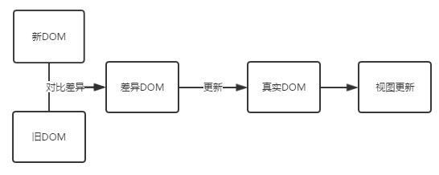

#  Dom Diff
### 什么是虚拟DOM
当我们更新了state中的值的时候，React会去调用render()方法来重新渲染整个组件，React实现了一个Virtual DOM，组件的真实DOM结构和Virtual DOM之间有一个映射的关系，React在虚拟DOM上实现了一个diff算法，当render()去重新渲染组件的时候，diff会找到需要变更的DOM，然后再把修改更新到浏览器上面的真实DOM上，所以，React并不是渲染了整个DOM树，Virtual DOM就是JS数据结构，所以比原生的DOM快得多。

### 为什么要用虚拟DOM
频繁操作DOM会造成页面卡顿影响用户体验  
虚拟DOM比真实DOM要快很多  
更新时，虚拟DOM不会直接更新，会和之前的进行比较，将不同的地方进行重新渲染，避免了无所谓的渲染

### 虚拟DOM的基本执行步骤
- 1，用JS构建出一颗虚拟DOM树，再用虚拟的DOM树去构建出一个真实的DOM树，插入到文档中
- 2，当树的状态发生改变的时候，重新构建出一颗新的DOM，并将新的树和旧的树进行对比，并记录两棵树的差异
- 3，把不同的地方重新渲染，相同的地方不会重新渲染

```
var objA = {
  el: 'div',
  class: 'A',
  children: [{
        el: 'div',
        class: 'B',
        children: [{
            el: 'div',
            class: 'D',
          },{
            el: 'div',
            class: 'E',
          }]
      },{
        el: 'div',
        class: 'C',
        children: [{
            el: 'div',
            class: 'F',
          },{
            el: 'div',
            class: 'G',
          }]
      }]
}
var objB = {
  el: 'div',
  class: 'A',
  children: [{
        el: 'div',
        class: 'C',
        children: [{
            el: 'div',
            class: 'D',
          },{
            el: 'div',
            class: 'G',
          }]
      },{
        el: 'div',
        class: 'B',
        children: [{
            el: 'div',
            class: 'E',
          },{
            el: 'div',
            class: 'F',
          }]
      }]
}
function difference(old,new) {

}
```