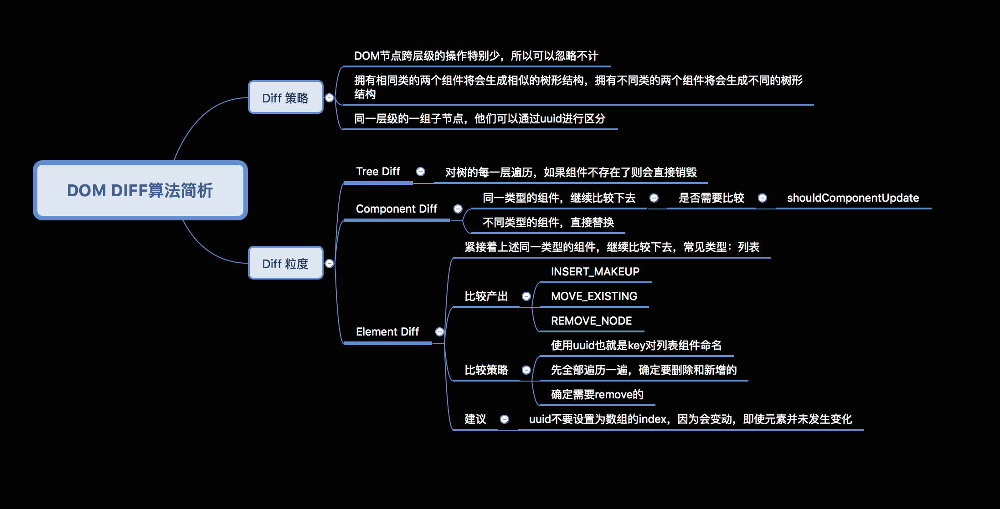
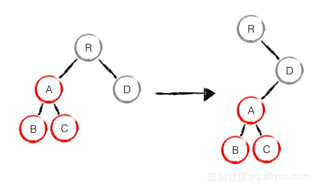

#  Dom Diff
### 什么是虚拟DOM
当我们更新了state中的值的时候，React会去调用render()方法来重新渲染整个组件，React实现了一个Virtual DOM，组件的真实DOM结构和Virtual DOM之间有一个映射的关系，React在虚拟DOM上实现了一个diff算法，当render()去重新渲染组件的时候，diff会找到需要变更的DOM，然后再把修改更新到浏览器上面的真实DOM上，所以，React并不是渲染了整个DOM树，Virtual DOM就是JS数据结构，所以比原生的DOM快得多。

### 为什么要用虚拟DOM
频繁操作DOM会造成页面卡顿影响用户体验  
虚拟DOM比真实DOM要快很多  
更新时，虚拟DOM不会直接更新，会和之前的进行比较，将不同的地方进行重新渲染，避免了无所谓的渲染

### 虚拟DOM的基本执行步骤
- 1，用JS构建出一颗虚拟DOM树，再用虚拟的DOM树去构建出一个真实的DOM树，插入到文档中
- 2，当树的状态发生改变的时候，重新构建出一颗新的DOM，并将新的树和旧的树进行对比，并记录两棵树的差异
- 3，把不同的地方重新渲染，相同的地方不会重新渲染


### DIFF算法解析

### DIFF算法在执行时有三个维度
#### Tree DIFF

Tree DIFF是对树的每一层进行遍历，如果某组件不存在了，则会直接销毁。如图所示，左边是旧属，右边是新属，第一层组件一模一样不会发生变化；第二层进入Component DIFF，组件类型相同然后继续比较下去，发现A组件没有，所以直接删掉A、B、C组件；最后重新创建A、B、C组件。 

#### Component DIFF  

Component DIFF是对树的每一层进行遍历如果组件不同，可以直接进行删除然后在替换
第一层中的组件一样，不发生改变，进入第二层Component Diff，左侧组件一模一样，不发生改变，右侧组件不一样，对于不同的组件可以直接删除替换
#### Element DIFF

Element DIFF紧接着以上统一类型组件继续比较下去，常见类型就是列表。同一个列表由旧变新有三种行为，插入、移动和删除，它的比较策略是对于每一个列表指定key，先将所有列表遍历一遍，确定要新增和删除的，再确定需要移动的。如图所示，第一步将D删掉，第二步增加E，再次执行时A和B只需要移动位置即可。


执行时按顺序依次执行，它们的差异仅仅因为DIFF粒度不同、执行先后顺序不同
```
var objA = {
  el: 'div',
  class: 'A',
  children: [
    {el: 'div',class: 'B',children: 
      [
        {el: 'div',class: 'D'},
        {el: 'div',class: 'E'}
      ]
    },
    {el: 'div',class: 'C',children: 
      [ 
        {el: 'div',class: 'F',},
        {el: 'div',class: 'G'}
      ]
    }
  ]
}
var objB = {
  el: 'div',
  class: 'A',
  children: [
    {el: 'div',class: 'C',children: [
      {el: 'div',class: 'D'},
      {el: 'div',class: 'G'}
      ]
    },
    {
      el: 'div',class: 'B',children: [
        {el: 'div',class: 'E'},
        {el: 'div',class: 'F'}]
    }
  ]
}
function difference(old,new) {
  console.log([...old])
}
```